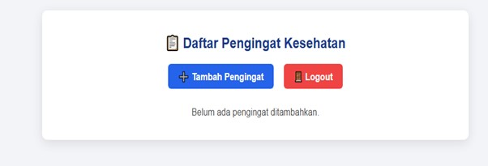
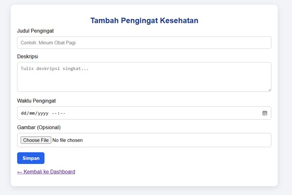
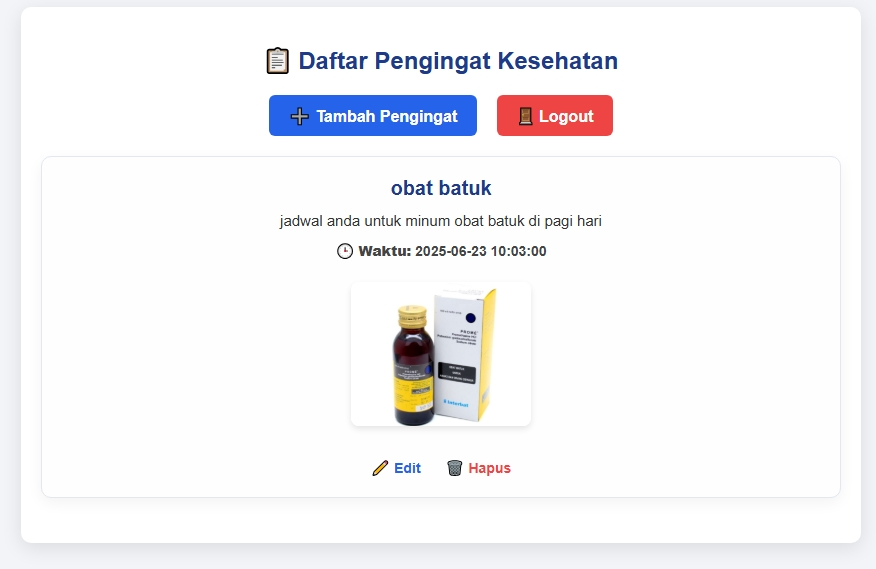

Aplikasi Pengingat Kesehatan

Aplikasi berbasis website sederhana untuk mencatat dan mengelola pengingat jadwal kesehatan seperti konsumsi obat, dengan fitur unggah gambar.

📌 Fitur Utama
- Registrasi dan Login pengguna
- Tambah, Edit, dan Hapus pengingat
- Upload gambar obat/tindakan
- Dashboard pribadi berdasarkan user
- Tampilan bersih dan responsif

🚀 Cara Menjalankan
1. Clone repository ini ke htdocs/ di XAMPP
2. Jalankan Apache dan MySQL via XAMPP
3. Import file aplikasi_kesehatan.sql ke phpMyAdmin
4. Akses di browser: [http://localhost/aplikasi_pengingat_kesehatan](http://localhost/aplikasi_pengingat_kesehatan)

🗂 Struktur Folder
- index.php, register.php, dashboard.php → halaman utama
- tambah.php, edit.php, hapus.php → manajemen pengingat
- koneksi.php → koneksi database
- folder_upload/ → menyimpan gambar
- assets/style.css → tampilan halaman

